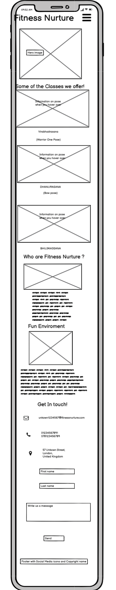
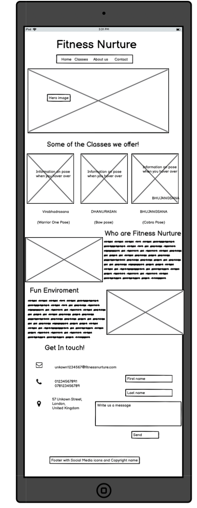
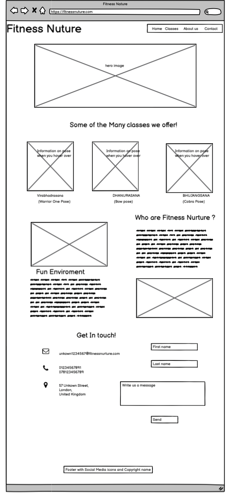
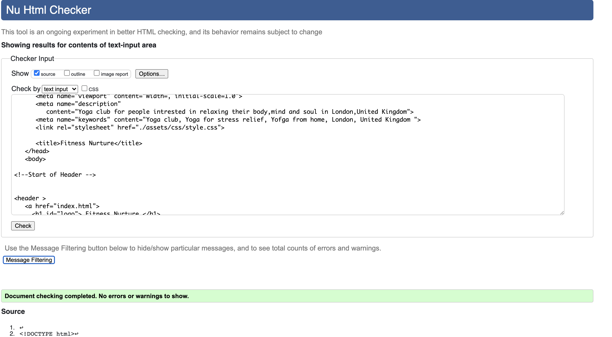
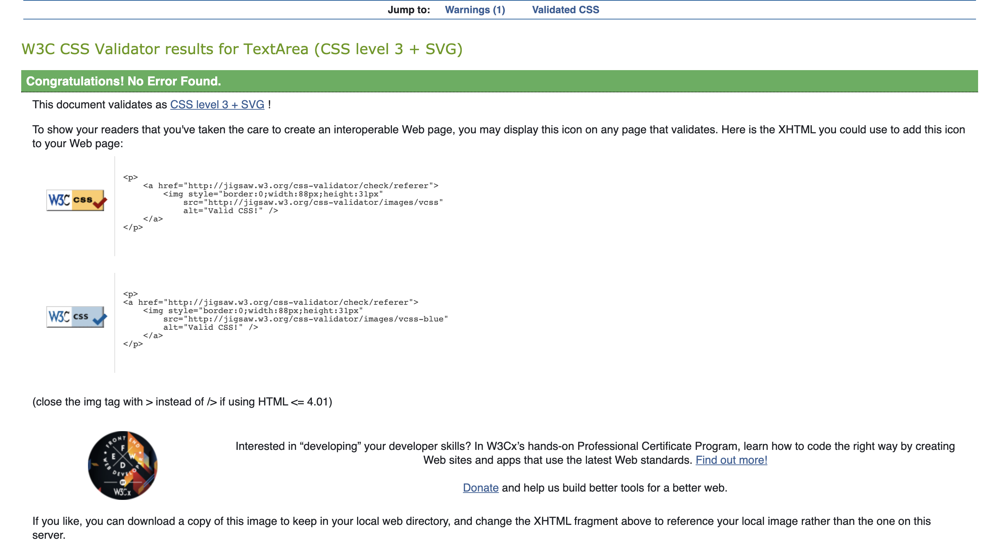
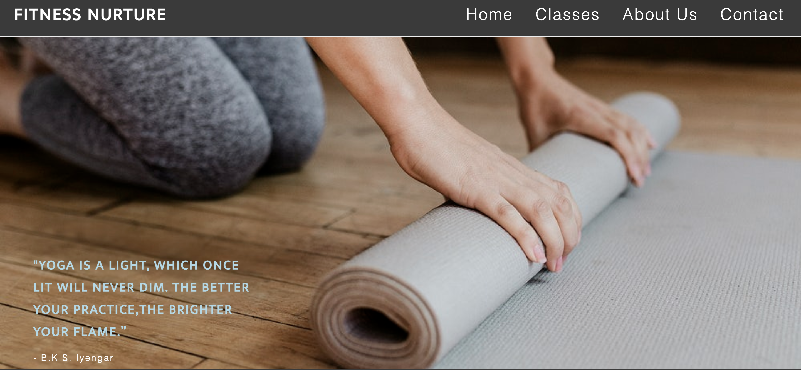
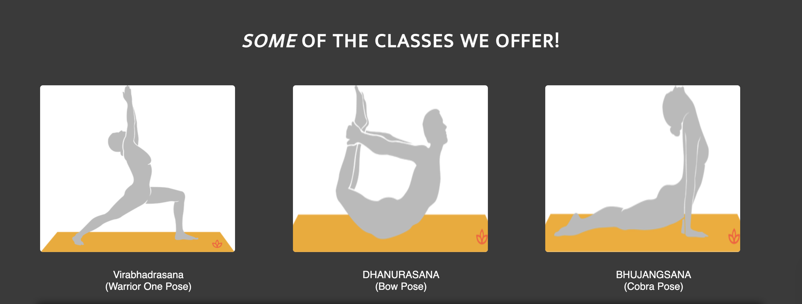
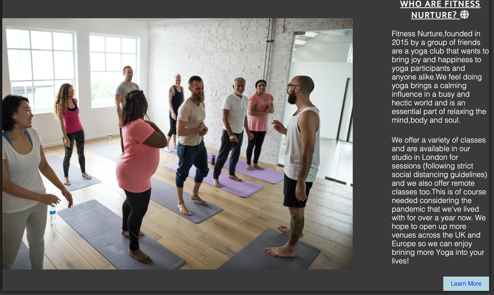
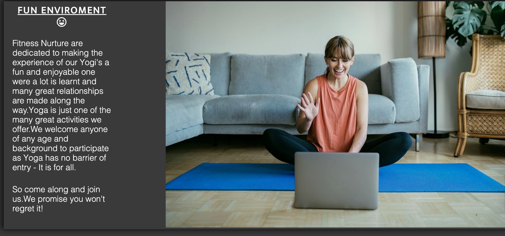
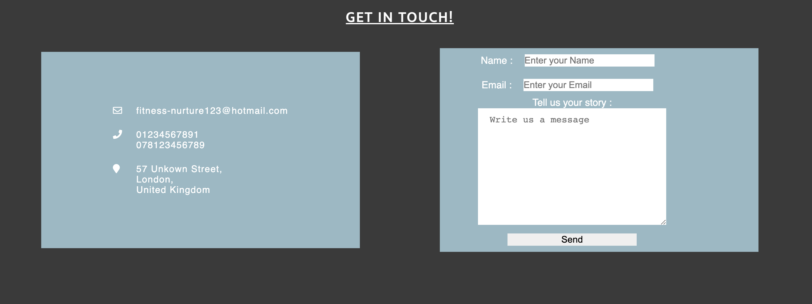

#  Fitness Nurture

[View the live site here](https://ibrahimali31.github.io/fitness-nurture/)

This website is centered for Yoga lovers and anyone that has a passion and interest 
in joining and learning this craft.I have created this website for my Project 1 with
code institute.

 

Responsiveness of website tested on [Am I Responsive](http://ami.responsivedesign.is/)

# Table of Contents 
* Purpose
  * User Experience
  * User Stories
  * First Time Visitor Goals 
  * Second Time Visitor Goals
  * Site Owner Goals

* Design 
  * Color Schemes 
  * Wireframe 
  * Typography 
  * Imagery

*  Features 

   * Current Feature 
   * Features to Implemend

* Technologies Used 

* Testing 

  * Responsiveness 
  * W3C Validator tools
  * Lighthouse 

* Deployment 

  * Github Project Creation 
  * Github Pages 
  * Locally Run 

* Credits 

 

## Purpose 

The Covid impact has affected everyone all over the world in a number of different ways.Goverment restrictions
have caused leisure centres and other health centres to close for a long period of time meaning there is less 
people living healthly and being active which is an essiential part of daily life.This fictional Yoga club which 
i have based in London,offers Yoga sessions for people who are unable to leave their houses due to restrictions and 
would rather do Yoga from home so they are still able to live a more relaxed life.

I have built a fully responsive website to let my customers know of what we offer at the club and our ethos.Fitness 
Nurture wants to be the best yoga club for any Yogi's across the capital and far beyond.

# User Expereince

 ## User Stories 

 ### First Time Visitor Goals

 - As a first time visior,i would like to know why doing Yoga will benefit me so much.

 -  As a first-time visitor, I would want to look into their social media following/links to see how popular they are.

 - As a first time visitor,i would like a easily accessable webpage which i can navigate through easily.

 ### Returning Visitor Goals

 - As a returning visitor,I would like to have a look at the excersises and instructions on it
 - As a returning visitor I would like to know more about the Classes on offer.

    

### Site Owner Goals 

- As a site owner i would like for my users to have a clear understanding of what we offer 

-  As a site owner,i would like for users to share good experiences they've had on their website with
   families and friends so we can build up relationships and increase our following.

- As a site owner,I would like users to know that they can put forward any query and they will be responded 
to in a fast and in a responsobile way.

# Design

## Colours 

I went with only three colours to keep a nice balane and format throughout the page.This was #3a3a3a,#add8e6 and #fff.
The grey was used for the background colour of the whole HTML file.The white colour was used for the Headings to give it 
a nice contrast.The light blue was used when hovering over the navigation bars and also on the contact form.

## Wireframes 

Fitness Nurture is a single paged website with four different navigation icons.The single page design was chosen as i felt
that there was enough content to only fill just a single page and more imagery was necessary to catch the users attention.

Please see the wireframes below for the varying devices:

   

## Typography 

The fonts chosen for my project were Roboto and Mukta as i thought they  both completmented each other well and the boldness 
of the strcture catches the users mind immideatly and also helps any Visually Impreared users.For my Logo i have chosen Roboto and 
for my main headings and text i have gone with Mukta.Sans-serif has been added as a backup font in the event that the fonts do not load.

## Imagery 

The images from my website have been acquired from [RawPixel](https://www.rawpixel.com/search/yoga%20free%20images?sort=curated&page=1RawPixel)(Hero and About us images) and [YogaPedia](Yhttps://www.yogapedia.com/) (Class images section)

# Features 

## Exsisting Features 

For my  project I have gone with a single page website, Which is fully responsive and consists of a header, footer and 4 main sections; Home, Classes, About Us and Contact.

### Navigation 

I have implemented a navbar wgich is fully responsive and collapses down into a hamburger menu on smaller devices. It provides a full list of links to access each of the key sections on the website.

### Hero Image 

The hero image sets the stage for The Fitness Nurture website along with the motiviational qote which i have assigned inside the image 
for the user to see as soon as they have go onto the website.This provides the user with a feel good message and something which they 
can take positively to keep scrolling down the page.

### Classes 

The classes section shows three of the different Yoga poses which we offer.They are laid side by side and when they are hovered open they
increase in size and some text is shown inside which are the meaning/instructions and benefits of the pose.This provides the user a fun 
and interactive way of finding more about some of the poses we offer.

### About us

The About us section provides the user with a background of why this Yoga club was started,Its motivitions and future goals.We stress to 
the user that we are accepting of all people and that we are a fun enviroment.I have added two images with two different text sections which
are side by side.When viewed on smaller screen devices the images and text stacked up on eachother to provide a more stuctured layout.There is also a call to action on this page which can direct the user to our contact section.

### Contact 

The contact sections consitis of two blocks one of which is the address,email and contact numbers of the Fitness Nurture yoga club.The 
other block is made up of a Form which the user can submit for any other queries they would like to find out about the club.When viewed 
on smaller screens they are stacked on top of eachother to maintain a proper layout.

### Footer 

The Footer consists of four different social media links and icons for Instagram,Facebook,Youtube and Twitter.This is where the user can find out more about our how we operate.

### Future Features 

In the future,I would like to include a newsletter option to our users which provides them insights and trends on Yoga and also indiviual
videos for different Yoga poses.

# Technologies Used. 

- [Gitpod](https://www.gitpod.io/))
 GitPod was used as the IDE for this project and Git has been used for Version Control.

- [Github](https://github.com/)
GitHub was used to create a repository to host the project and to gain  commits from GitPod.

- [Google Fonts](https://fonts.google.com/)

 Google Fonts was used to stlye my HTML text.

- [Font Awesome](https://fontawesome.com/)
Font Awesome was applied to the About us and Footer sections.

- [Javascript](https://www.javascript.com/)
Javascript was used to make the Nav bars displayy 

- [Balsamiq](https://balsamiq.com/) 

Balsamiq was used to plan out the website and create wireframes for the basic design of it.

- [Am I Responsive](http://ami.responsivedesign.is/)
Am I Responsive was used to create the header image for the README file.

- [Chrome Developer Tools](https://developer.chrome.com/docs/devtools/)
Chrome Dev Tools was used to test the site, assist with debugging issues and run reports from Lighthouse.

- [W3C Markup Validation Service](https://validator.w3.org/)
    W3C Markup Validation  was used to validate the HTML document for this project and to identify any issues with the code.

-  [W3C CSS Validation Service](https://jigsaw.w3.org/css-validator/)
   W3C CSS Validation  was used to validate the CSS document for this project and to identify any issues with the code.

# Responsiveness 

The responsiveness of my website was checked by using Responsinator and [Am I responsive](http://ami.responsivedesign.is/).

## W3C Validator Tools 

The website HTML and CSS were regularly run through the W3C Markup Validation Service and CSS Validation Service. A final validation check was performed with no errors before submitting the project which you can see here.  

Lighthouse was also used to test my accessibility of my page and this was given a good score. 

# Testing 

## User Testing 

- As a first time user i would like to understand the ethos and the values behind the company
- As a first time user i would like to know why this company wil be better for me than others

   

At the top of the website once the user has entered there is a navigation bar where the user has the option if going to different sections of the wep page.By clicking on "Classes" this will give the user more information on the tests we do and how we would instruct them how to do it also.Also at the top ofthe navigation 'About Us' section which will direct the user to the relevant section where they can learn more about the company, it's purpose and its ambitions. The user is also able to access this information by simply scrolling down the page, and the section is called "Who are fitness nurture?.The classes when scrolled give a zoom in animation which can provke a great response for the user and this explains to them all the information on that specific pose.There is also a CTA button on the abous us section where the customer will be taken to the contact section.

- As a First Time Visitor I want to find information on the Yoga poses available and how i can do this.
- As a Returning Visitor I want to continue to continue doing these poses to have the full benefit of Yoga.
- As a Site Owner i want the information on my website to be as clear as possible so that the user can perform these 
poses in a safe and professional way.

 

As a First Time Visitor I want to locate their social media accounts so I can receive updates and see their following and how well they are known and reliable.I would also like their contact numbers for any emergency queries or also their address so we can speak face to face.

As a Site Owner I want users to be able to locate us on social media or by other means.

The contact and footer sections provide different means of contact to where the patient can find us.This is very helpful in the fact that 
if a patient can only message us we have the option of a message.If they can't message then they can call etc.There's mamy different ways 
a customer can contact us which means that we build a better Rapport with the user.The social media links will open up on a different tab 
to the chosen social media page and the form cannot be put through without filling all the correct information.

The website was tested across different browsers including Google Chrome,Mozilla Firefox and Safari. It rendered well on both browsers and worked as intended.

# Deployment 

## Github Project Creation

1 Click the green 'New' button in my GitHub repositories section
2 Select the Code Institute template
3 Name repository "Fitness Nurture" 
4 Set repository to 'Public' to ensure the commit history is visible
5 Click 'Create repository'

## Github Pages

The project was deployed to GitHub Pages using the following steps :

1 Sign in to GitHub and locate the GitHub Repository
2 At the top of the Repository find  the "Settings" Button on the menu.
3 Alternatively Click Here for a GIF demonstrating the process starting from Step 2.
4 Scroll down the Settings page until you locate the "GitHub Pages" Section.
5 Under "Source", click the dropdown called "None" and select "Master Branch".
6 The page will automatically refresh.
7 Scroll back down through the page to locate the now published site link in the "GitHub Pages" section.

## Run Locally

1 Select the Repository for the project from the GitHub dashboard.
2 Find the 'Code' button, and from the dropdown select 'Download ZIP'.
3 Open a new terminal and write the 'git clone' command in the CLI and paste copied URL
4 Collect the downloaded  file on your device.

# Credits

## content

- Yogapedia was used for the images on the Classes section as well as the information inside.
- Sign up form on the Love running section 1 was deployed into my code for the form and altered.

