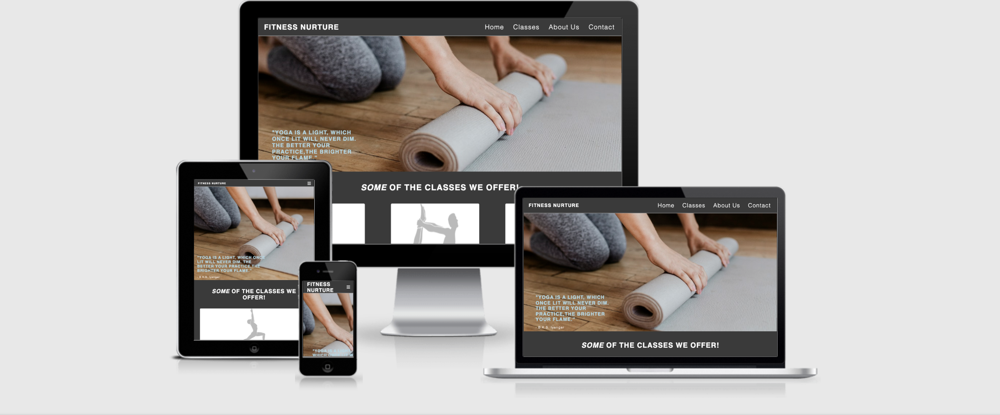

#  Fitness Nurture

[View the live site here](https://ibrahimali31.github.io/fitness-nurture/)

This website is centered for Yoga lovers and anyone that has a passion and interest 
in joining and learning this craft.I have created this website for my Project 1 with
code institute.

 

Responsiveness of website tested on [Am I Responsive](http://ami.responsivedesign.is/)

# Table of Contents 
* Purpose
  * User Experience
  * User Stories
  * First Time Visitor Goals 
  * Second Time Visitor Goals
  * Site Owner Goals

* Design 
  * Color Schemes 
  * Wireframe 
  * Typography 
  * Imagery

*  Features 

   * Current Feature 
   * Features to Implemend

* Technologies Used 

* Testing 

  * Responsiveness 
  * W3C Validator tools
  * Lighthouse 

* Deployment 

  * Github Project Creation 
  * Github Pages 
  * Locally Run 

* Credits 

 

## Purpose 

The Covid impact has affected everyone all over the world in a number of different ways.Goverment restrictions
have caused leisure centres and other health centres to close for a long period of time meaning there is less 
people living healthly and being active which is an essiential part of daily life.This fictional Yoga club which 
i have based in London,offers Yoga sessions for people who are unable to leave their houses due to restrictions and 
would rather do Yoga from home so they are still able to live a more relaxed life.

I have built a fully responsive website to let my customers know of what we offer at the club and our ethos.Fitness 
Nurture wants to be the best yoga club for any Yogi's across the capital and far beyond.

# User Expereince

 ## User Stories 

 ### First Time Visitor Goals

 - As a first time visior,i would like a clear and consice understanding of what the company offers.

 -  As a first-time visitor, I would want to look into their social media following/links to see how popular they are.

 - As a first time visitor,i would like a easily accessable webpage which i can navigate through easily.

 ### Returning Visitor Goals

 - As a returning visitor,I would like to have a look at the excersises and instructions on it
 - As a returning visitor I would like to know more about the Classes on offer.

 
### Frequent Visitor Goals

- As a frequenent visior i would like to know if they have a loyalty points service 
- As a frequenent visior i would like to know if there is a way i could become a Yoga teacher
 - As a frequenent visior
    

### Site Owner Goals 

- As a site owner i would like for my users to have a clear understanding of what we offer 

-  As a site owner,i would like for users to share good experiences they've had on their website with
   families and friends so we can build up relationships and increase our following.

- As a site owner,I would like users to know that they can put forward any query and they will be responded 
to in a fast and in a responsobile way.

# Design

## Colours 

I went with only three colours to keep a nice balane and format throughout the page.This was #3a3a3a,#add8e6 and #fff.
The grey was used for the background colour of the whole HTML file.The white colour was used for the Headings to give it 
a nice contrast.The light blue was used when hovering over the navigation bars and also on the contact form.

## Wireframes 

Fitness Nurture is a single paged website with four different navigation icons.The single page design was chosen as i felt
that there was enough content to only fill just a single page and more imagery was necessary just to describee the settings 
o

